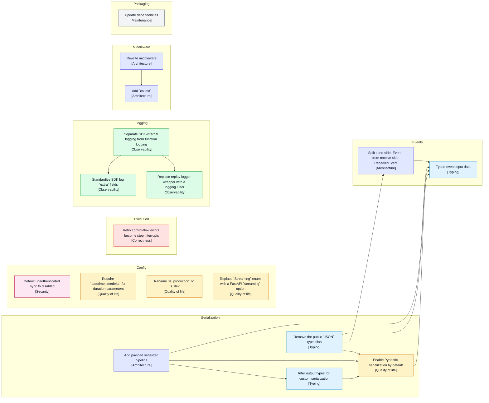

# v0.6 specs

## Foundation

This diagram is derived from each spec's `### Blocking` section.

Arrows point from blocking prerequisite to dependent spec.

# TypeScript SDK parity

No specs yet.

- Checkpointing
- Deferred functions
- Experiments
- Metadata
- Scoring
- OTel AI metadata extraction
