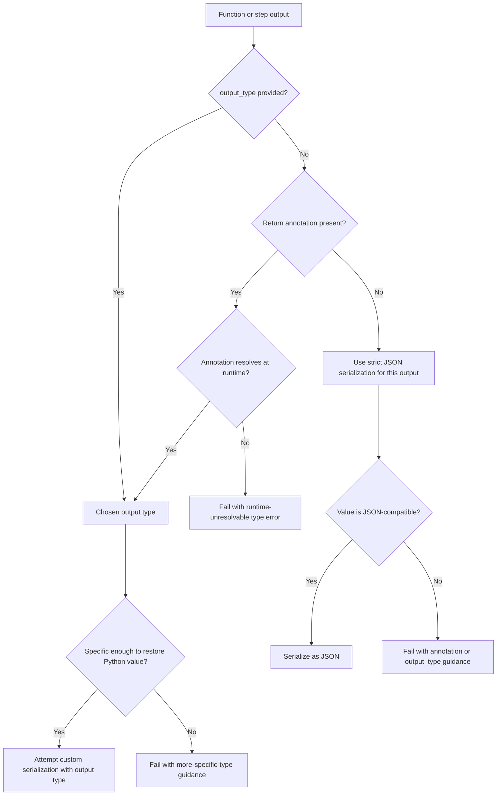

# Infer output types for custom serialization

Area: Serialization
Change type: Typing

## Problem

Returning non-`json.dumps`-compatible values from an Inngest function or `step.run` currently requires passing `output_type`. This is awkward for common typed outputs like Pydantic models because users often already write return annotations that describe the same type.

## Solution

Use an explicit `output_type` when one is provided. Otherwise, infer the output type from the function or step callback return annotation.

Known output types must resolve at runtime and be specific enough to restore the Python value later. If no output type is known, that output uses strict JSON serialization and bypasses custom serializers.

The decision flow is:



## Out of scope

This does not infer types for `step.invoke_by_id` or functions outside the current SDK process. The SDK also does not attempt to recover from annotations that cannot be resolved at runtime; those annotations fail as described in the solution flow.

Adding an explicit `output_type` option to `step.invoke_by_id(...)` may be useful in the future, but it is out of scope for this change.

The SDK may eventually add a permissive mode that ignores unresolvable output annotations and uses strict JSON serialization for that output, but this change uses fail-fast annotation resolution.

## Risks

Runtime annotation resolution can be fragile around wrappers, partials, postponed annotations, and generics. The SDK must prefer explicit `output_type` and produce actionable errors when inference fails. Fail-fast resolution may require some users to fix annotations that previously existed only for static type checkers.

## Blocked by

[`foundation/payload_serializers.md`](./payload_serializers.md) defines the payload serializer protocol and `PayloadSerializerContext.typ`. This spec depends on that serializer contract so inferred output types can be passed consistently to serialization and deserialization.

## Context

Examples of runtime-unresolvable output types include:

- A forward reference whose target is not imported yet, such as `-> "User"` when `User` is unavailable.
- A type imported only inside `if typing.TYPE_CHECKING`.
- A type hidden by a circular import when annotations are resolved.
- A local class or type alias that is not available from the callable's runtime namespace.
- A wrapper or partial that hides the original callable's return annotation.

Parameterized generic types are supported when their type arguments are concrete and usable, such as `list[User]` or `dict[str, User]`. Generic return annotations that still contain unresolved type variables, such as `T` or `list[T]`, are not specific enough to restore the Python value and should fail with more-specific-type guidance.

## Implementation

```python
@client.create_function(
    fn_id="load-user",
    output_type=User,
    trigger=inngest.TriggerEvent(event="user/load"),
)
async def load_user(ctx: inngest.Context) -> User:
    return User(name="Alice")

async def get_users() -> list[User]:
    return [User(name="Alice")]

users = await ctx.step.run("get-users", get_users, output_type=list[User])
```

With inference:

```python
@client.create_function(
    fn_id="load-user",
    trigger=inngest.TriggerEvent(event="user/load"),
)
async def load_user(ctx: inngest.Context) -> User:
    return User(name="Alice")

async def get_users() -> list[User]:
    return [User(name="Alice")]

users = await ctx.step.run("get-users", get_users)
```

The SDK should not use custom serialization for function or step output without a known output type just because the default serializer can dump the value. Unknown output types use strict JSON serialization for that output instead.

Strict JSON serialization means the value must be accepted by the SDK's normal JSON response serialization without invoking custom serializers. It uses normal JSON serialization and deserialization semantics, and it does not preserve Python-specific container types. For example, an unannotated step callback that returns `(1, 2)` may replay as `[1, 2]`. If users need Python-specific type preservation, such as deserializing back into `tuple[int, int]`, the output needs an inferred or explicit output type.

`output_type` remains as an explicit override for cases that runtime Python cannot infer reliably:

- Unannotated functions or step callbacks returning custom objects
- Annotations that cannot be resolved at runtime
- Wrappers or partials that hide the original return annotation
- Generic helpers whose concrete return type is not present in the runtime annotation

`step.invoke_by_id(...)` remains untyped for output in this spec. It should keep its current return type of `object` because there is no local `Function` object to inspect, and the target may live outside the current SDK process, outside the current app, or outside Python entirely.

`step.invoke(function=...)` should use the target `Function` object's explicit or inferred output type for output deserialization. Output type validation happens on the target function, not at each invocation call site.

### Usable output types

A usable output type is a runtime-resolved type that gives serializers enough information to serialize a Python value and later deserialize the memoized JSON value back into a predictable Python value.

Usable output types include:

- Concrete runtime classes, including Pydantic models, dataclasses, enums, and scalar builtins.
- `None` or `type(None)`, but only for outputs that are actually `None`.
- `Annotated[T, ...]` when `T` is usable. The SDK should preserve the full `Annotated[...]` object when passing `typ` to serializers so serializer authors can inspect metadata.
- `Literal[...]` values when every literal value is JSON-compatible.
- Parameterized containers such as `list[T]`, `dict[str, T]`, `tuple[T, ...]`, and `tuple[T1, T2]` when their contained types are recursively usable.
- Unions, including `T | None`, when every non-`None` member is usable.
- Type aliases after they resolve to a usable type.

A base class output type only promises deserialization back into that base class. It does not preserve subclass identity unless the declared type carries that information, such as a concrete subclass, union, discriminated union, or custom serializer convention.

The following are not usable output types for custom round-trip serialization:

- `Any`
- `object`
- Unresolved `ForwardRef` values or postponed annotations that cannot be resolved
- Bare containers such as `list`, `dict`, `tuple`, or `set`
- Containers whose type arguments are not usable, such as `list[Any]` or `dict[str, object]`
- Type variables that remain unresolved at runtime

Resolved but unusable output types fail before serialization. This applies whether the unusable type came from explicit `output_type` or from a return annotation. For example, `output_type=Any`, `output_type=object`, `-> Any`, and `-> object` should all fail with a clear error telling the user to use a more specific type.

`NoReturn` and `Never` mean the callable is not expected to return a value. They do not enable output serialization. If a callable annotated with `NoReturn` or `Never` returns a value, fail with a clear error instead of treating the annotation as an output type.

Payload serializers remain type-aware through `PayloadSerializerContext.typ`. The SDK should pass the inferred or explicit output type as `typ` to both serialization and deserialization. This makes Pydantic models, dataclasses, unions, parameterized collections, and custom serializer-backed types work without duplicating type information in normal annotated code.

If `serializer=None`, inferred or explicit output types are still resolved, but non-JSON-compatible outputs fail because no custom serializer is available.

`on_failure` handler output is one-way and does not need output type inference. The SDK never deserializes `on_failure` output, so it can serialize the returned value as JSON without a round-trip output type.

### Explicit `output_type` precedence

If `output_type` is provided, it completely overrides return-annotation inference. The SDK must not resolve the callable's return annotation for output inference in that case. This lets users override missing, overly broad, incorrect, or runtime-unresolvable return annotations.

The explicit `output_type` itself must be usable. If a user passes `output_type=Any`, `output_type=object`, a bare container, an unresolved forward reference, or another unusable type, fail immediately with a clear configuration error.

### Annotation resolution timing

If no return annotation is present, the output type is unknown and JSON-compatible returns still work through strict JSON serialization for that output.

If a return annotation is present and no explicit `output_type` is provided, the SDK must resolve it when it inspects the callable.

Resolve annotations with `typing.get_type_hints(..., include_extras=True)` so postponed annotations, forward references, `Annotated`, and type aliases are handled consistently with [`foundation/typed_event_input_data.md`](./typed_event_input_data.md).

- Function handler return annotations are resolved during function registration or sync.
- `step.run` callback return annotations are resolved when `step.run` is called.

For function handlers, the SDK should try to resolve return annotations when the function is registered. If a forward reference or import cycle cannot be resolved at decorator time, defer validation until sync. Do not defer output annotation validation until first execution; failures should happen before the function can receive traffic.

For `step.run` callbacks, the callable is supplied during execution. If the callback's return annotation cannot be resolved when `step.run` is called, fail immediately before executing the callback or planning the step. Users can remove the annotation, make it runtime-resolvable, or pass explicit `output_type`.

### Docs

Document the new inference behavior in the migration guide:

- `output_type` still takes precedence.
- Return annotations are used when `output_type` is omitted.
- Runtime-unresolvable annotations fail fast: at startup when the callable is known before execution, such as function output, or during execution when the callable is only available then, such as `step.run` callback output.
- Explain that runtime-unresolvable means the SDK cannot turn the annotation into a real Python runtime type with `typing.get_type_hints(..., include_extras=True)`.
- Include common examples: forward references whose target is not imported yet, annotations that depend on imports guarded by `if typing.TYPE_CHECKING`, circular imports where the type is unavailable when annotations are resolved, local type aliases or classes that are not available from the callable's runtime namespace, and wrappers or partials that hide the original callable annotation.
- Distinguish runtime-unresolvable annotations from resolved but unusable annotations. For example, `MissingUser` might be unresolvable, while `Any`, `object`, and bare `list` resolve successfully but are invalid output types for custom round-trip serialization.
- Users can fix failures by making annotations runtime-resolvable, making annotations more specific, removing annotations when strict JSON serialization is acceptable, or passing explicit `output_type`.

### Tests

Add coverage for:

- Explicit `output_type` skips return-annotation resolution, including when the return annotation is unresolvable.
- Unusable explicit `output_type` values fail immediately with a clear configuration error.
- Unannotated JSON-compatible outputs still work through strict JSON serialization.
- Unannotated non-JSON-compatible outputs fail with a clear error.
- `Any`, `object`, bare containers, and unresolved type variables fail clearly as output types.
- `None` and `type(None)` support `None` outputs.
- `NoReturn` and `Never` fail clearly if the callable returns a value.
- Parameterized containers, unions, optional types, and `Annotated[...]` can be used for custom round-trip serialization when their nested types are usable.
- `typing.get_type_hints(..., include_extras=True)` resolves postponed annotations, type aliases, forward references, and `Annotated[...]` metadata where possible.
- Function handler return annotation failures surface during registration or sync, not first execution.
- `step.run` callback return annotation failures surface when `step.run` is called and before the callback is executed.

## References

[`foundation/pydantic_serialization_by_default.md`](./pydantic_serialization_by_default.md) builds on this spec so default Pydantic serialization can round-trip function and step outputs without requiring duplicate `output_type` arguments.

[`foundation/typed_event_input_data.md`](./typed_event_input_data.md) uses the same annotation-resolution mechanics for handler `Context[...]` annotations.
